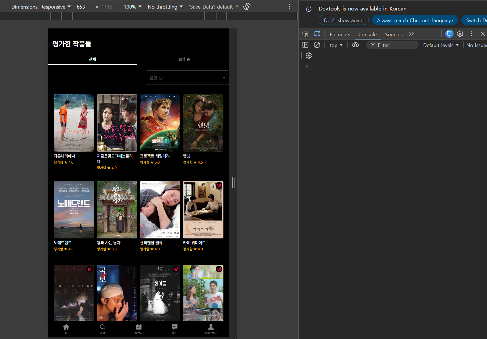
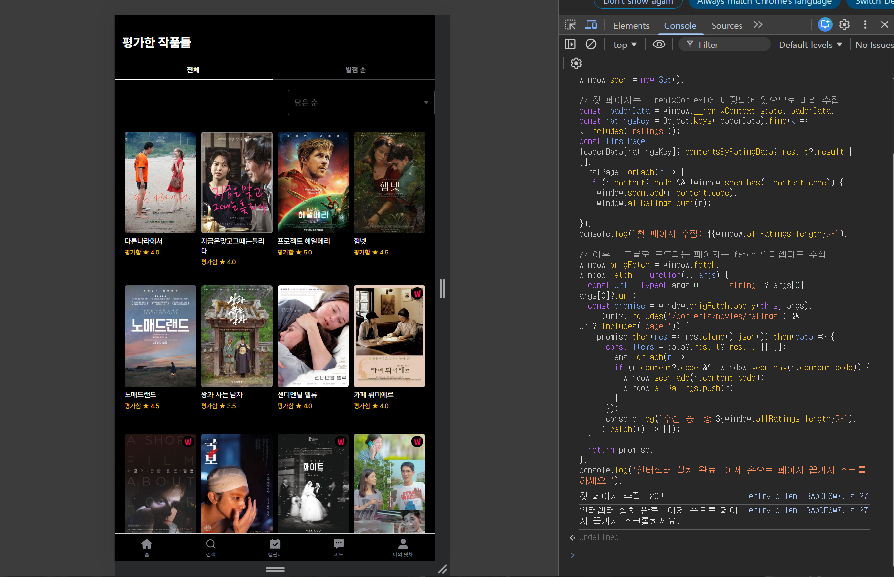
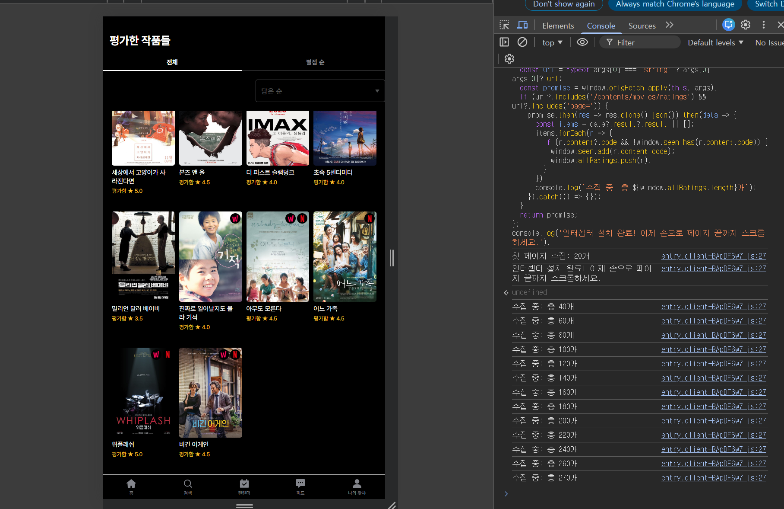
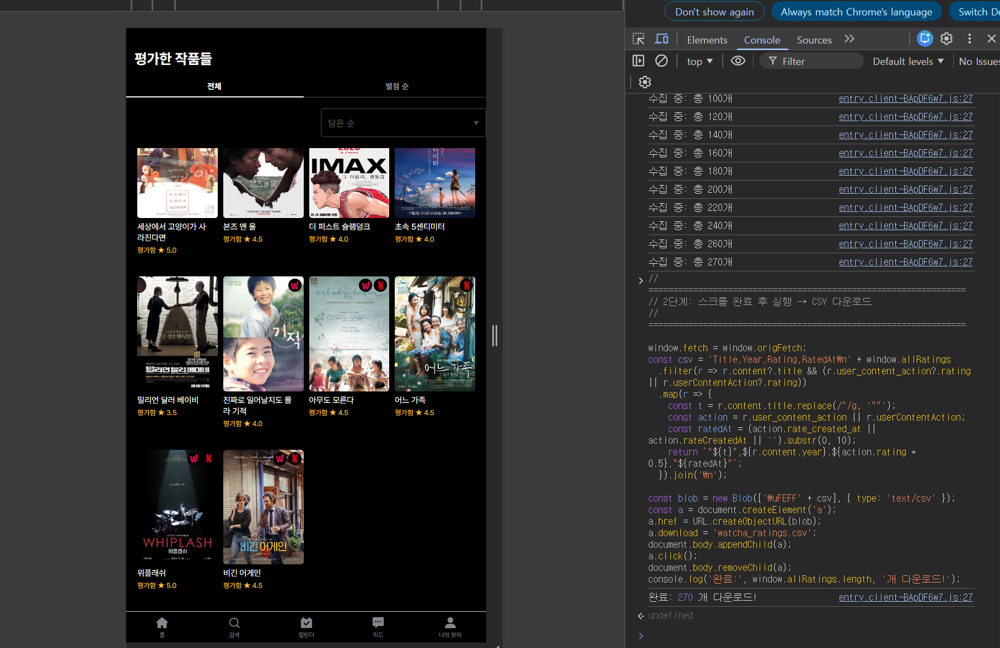
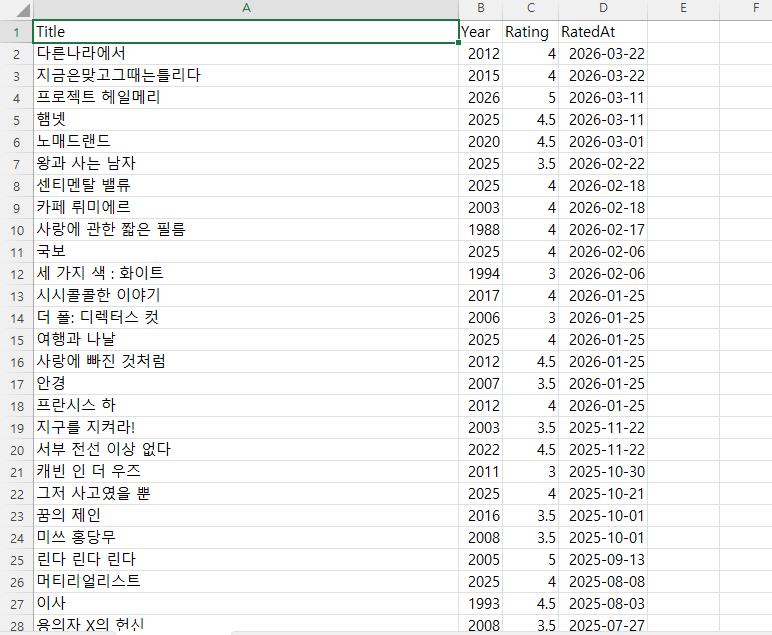

# 왓챠피디아 영화 평가 CSV 추출기

왓챠피디아에서 내 영화 평가 목록을 CSV 파일로 추출하는 스크립트입니다.

아마 기존의 코드 한줄만 실행하면 되는 간단한 추출 방법(https://github.com/erinyskim/watchapedia-export)이 왓챠 API 클라이언트 검증이 강화됨에 따라 실행이 안되는 것 같아서, 임시방편으로 직접 fetch 인터셉터로 요청을 가로채는 방식을 사용했습니다. 순서를 따라서 실행해보세요.

## 사용법

### 1. 평가 목록 페이지 접속

### 주의!

- 제공되는 코드는 평가한 작품들 페이지에서만 작동됩니다.
- 따라서 로그인 후 ratings 페이지까지 이동 후 실행해야합니다.

```
https://pedia.watcha.com/ko-KR/users/{유저코드}/contents/movies/ratings
```

### 2. 크롬 개발자 도구 열기

- `F12` → **Console** 탭 클릭
- **Console**은 일종의 코드 실행 장소라고 생각하시면 됩니다.



### 3. 1단계 코드 실행

- `watcha_step1.js` 내용을 콘솔에 붙여넣고 실행합니다.



### 4. 직접 페이지 끝까지 스크롤

- 콘솔에 수집 개수가 표시됩니다. 왼편에 보이는 실제 페이지에서 마우스 휠을 사용해 페이지 끝까지 스크롤하세요.



### 5. 2단계 코드 실행

- 전부다 스크롤 해서 맨 밑 페이지까지 도착했다면, 다음을 실행합시다.
- `watcha_step2.js` 내용을 콘솔에 붙여넣고 실행 → CSV 자동 다운로드



## CSV 형식

추출된 형식은 다음과 같습니다.

| 컬럼    | 설명                   |
| ------- | ---------------------- |
| Title   | 영화 제목              |
| Year    | 개봉 연도              |
| Rating  | 별점 (0.5 ~ 5.0)       |
| RatedAt | 평가 날짜 (YYYY-MM-DD) |



- 이후 추출된 csv 파일을 다른 서비스로 옮기시면 되겠습니다.

## 주의사항

- **왓챠피디아(pedia.watcha.com)** 에서만 동작합니다
- 반드시 **로그인 상태**에서 실행하세요
- 콘솔(`F12`)에서 실행해야 합니다 (URL 창 javascript: 방식 불가)
- 포맷은 레터박스에 맞춰져 있다는 점 참고해주세요.

## (참고) 레터박스 csv import 페이지

https://letterboxd.com/import/
